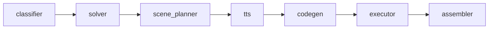

<h1 align="center">Math Video Agent</h1>

<p align="center">
  
  
  
  
  
  
</p>

**An AI agent that turns a math problem into a narrated animated explanation video.**

A multi-step LangGraph pipeline solves the problem, plans it into scenes, generates and renders Manim animations, and narrates each one with TTS, exposed through a FastAPI backend and a Next.js frontend.

---

## Features

- Verifies every answer with sympy instead of trusting the LLM's arithmetic
- Self-corrects failed animation renders by feeding the error back to the LLM, with a graceful fallback
- Runs every job in an isolated, resource-limited Docker sandbox
- Streams live pipeline progress to the frontend over a WebSocket

---

## System Architecture

Each job runs the pipeline below inside its own Docker container, orchestrated by a FastAPI job queue.



### Workflow Pipeline

1. **classifier**

   - Identifies topic and difficulty with a cheap Gemini model, and cleans up the problem statement.

2. **solver**

   - Has an LLM extract the problem into a sympy code snippet, then actually runs sympy to get the real answer.
   - Has an LLM write a step-by-step explanation guided by that real result, so narration never contradicts the math.
   - Ends the run with a clear error if sympy genuinely cannot solve the problem, instead of letting the LLM guess.

3. **scene_planner**

   - Groups the solution's steps into scenes, not necessarily one-to-one, and writes each scene's narration and animation plan.

4. **tts**

   - Generates narration audio for every scene and measures its actual duration.
   - Runs before codegen, so animation timing can be built around real narration length.

5. **codegen**

   - Generates Manim animation code per scene, and stretches each scene's pauses to match its narration's measured duration.

6. **executor**

   - Renders each scene with Manim, retrying with LLM-corrected code up to three times on failure.
   - Falls back to a title-only scene if every attempt still fails, keeping scene count aligned with the audio.

7. **assembler**

   - Adds narration to each scene's video, then concatenates every scene into the final MP4.

---

## Technical Highlights

- **Per-node error handling**: every node owns its own failure path instead of a shared corrector node. `executor_node` retries with LLM-corrected code, then falls back to a title-only scene rather than dropping it.
- **Narration drives scene timing, not the reverse**: TTS runs before code generation, so animations stretch to match narration length instead of speech getting cut off.
- **Sandboxed, restartable jobs**: each job runs in its own throwaway Docker container, with output on disk so status survives an API restart.
- **Constrained structured output**: classification fields use `Literal` types with Gemini's schema-constrained generation, so the API is structurally unable to return an inconsistent value.

---

## Tech Stack

| Layer | Technology |
|---|---|
| Pipeline orchestration | LangGraph |
| LLM | Gemini API (google-genai) |
| Math | sympy |
| Animation | Manim |
| Narration | Kokoro TTS |
| Video assembly | ffmpeg |
| Backend API | FastAPI |
| Frontend | Next.js, TypeScript, MUI (Material UI) |
| Sandboxing | Docker (per-job container) |
| Testing | pytest, Vitest, React Testing Library |

---

## Project Structure

```
math-video-agent/
├── backend/
│   ├── .env.example  # Template for backend/.env
│   ├── api/          # FastAPI app, job queue, sandbox orchestration
│   ├── config/       # Settings, LLM/TTS abstractions, structured-output schemas
│   ├── graph/        # LangGraph pipeline assembly, state, media paths
│   ├── nodes/        # One file per pipeline node
│   └── tests/
├── frontend/
│   └── src/
│       ├── app/          # Next.js app router
│       ├── components/   # Chat UI, sidebar, job progress, video player
│       └── hooks/        # Job submission, WebSocket, local history
├── docker-compose.yml
└── justfile
```

---

## Quick Start

Requires Docker and Docker Compose.

```bash
git clone https://github.com/Dennis-Diehl/math-video-agent.git
cd math-video-agent
cp backend/.env.example backend/.env   # then fill in GEMINI_API_KEY
just up
```

The frontend is then available at `http://localhost:3000`, the API at `http://localhost:8000`.

Common `just` recipes:

```bash
just backend-install    # set up backend/.venv with runtime + dev deps
just backend-dev        # run the API locally with auto-reload
just backend-test       # run backend tests
just backend-check      # lint + format-check + type-check the backend

just frontend-install   # install frontend dependencies
just frontend-dev       # run the frontend dev server
just frontend-test      # run frontend tests
just frontend-check     # type-check + lint the frontend

just test               # run backend + frontend test suites
just check              # run backend + frontend lint/type checks

just up                 # build and start the full stack via Docker Compose
just down               # stop and remove the stack
just logs               # tail logs from the running stack
```

---

## License

This project is licensed under the MIT License.
